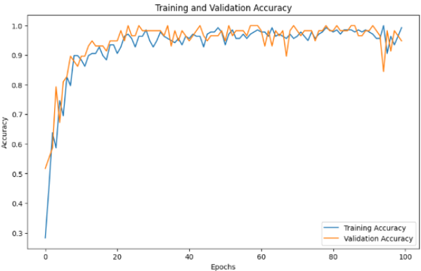

Soil Classification Agent
==================================================

Overview
--------
The **Soil Classification Agent** in the **Segma-Vision Agriculture** project is responsible for classifying soil types from image data. This agent leverages a deep learning model trained to recognize various soil types, providing essential insights for agricultural applications. It analyzes images of soil and outputs the predicted classification, which helps in decision-making related to farming practices and crop management.

Tasks handled by the Soil Classification Agent:

1. Soil type classification based on image data.
2. Soil analysis using image data to identify soil categories.

How It Works
------------
1. **User Input**: The user provides a query related to soil classification by uploading an image of soil or providing related information.
2. **Task Decision**: The **Input Agent** processes the user's request and identifies whether soil classification is required. If so, it routes the task to the **Soil Classification Agent**.
3. **Image Input**: The agent receives the soil image, which is then processed to classify the soil.
4. **Soil Classification**: The model, based on MobileNetV2 with custom layers, is used to classify the soil type into one of six predefined classes.
5. **Result Output**: The agent outputs the predicted soil class, helping users to understand the soil characteristics.

Model Architecture
------------------
The **Soil Classification Agent** uses a **MobileNetV2** model pretrained on **ImageNet** as the base. This base model is fine-tuned for the specific task of soil classification, which includes adding custom layers for improved performance on the target task.

**Base Model**:

- **Model**: MobileNetV2
- **Pretraining**: Trained on ImageNet

**Custom Layers**:

- **Global Average Pooling Layer**: Reduces the spatial dimensions of the feature maps, resulting in a vector that summarizes the features.
- **Dense Layer**: A fully connected layer with 1024 units and ReLU activation function.
- **Output Layer**: A softmax layer with 6 neurons, corresponding to the 6 soil types being classified.

**Optimizer and Loss Function**:

- **Optimizer**: Adam, an adaptive learning rate optimization algorithm.
- **Loss Function**: Categorical Crossentropy, used for multiclass classification tasks.
- **Metrics**: Accuracy and Recall, to monitor the model's performance during training.

Hyperparameters
---------------
- **Epochs**: 100
- **Batch Size**: 64
- **Augmented Data**: Training images undergo random transformations, such as rotation, scaling, and flipping, to improve the model's ability to generalize. Validation images are rescaled for consistency.
- **Learning Rate**: Default setting used by Adam optimizer.

Training Process
----------------
The training of the **Soil Classification Agent** involves using a large labeled dataset of soil images. The model is trained for 100 epochs, with each epoch using a batch size of 64 images. Random data augmentation is applied to the training images to increase diversity, while validation images are kept consistent by only rescaling them.

The **MobileNetV2** model is fine-tuned with the custom layers to improve its accuracy for soil classification. The model's performance is evaluated on the validation set using metrics such as accuracy and recall.

Training and Validation Accuracy Graph
--------------------------------------
The graph below shows the training and validation accuracy over the 100 epochs. This helps visualize the model's learning progress and its ability to generalize to unseen data.

    *Figure 1*: Training and Validation Accuracy for Soil Classification.

The graph provides insight into the model's training process. Ideally, both the training and validation accuracy should increase steadily over time, indicating that the model is learning and not overfitting.

Model Evaluation
----------------
After training, the model's performance is evaluated using the validation set. The evaluation metrics include:

- **Accuracy**: The percentage of correctly classified soil types out of all predictions.
- **Recall**: The model's ability to correctly identify soil types from the total number of true positives.

The following command demonstrates how to evaluate the model on the validation set:

.. code-block:: python

    # Evaluate model on validation data
    val_predictions = model.predict(X_val)
    val_accuracy = accuracy_score(y_val, val_predictions)

    print(f'Validation Accuracy: {val_accuracy * 100:.2f}%')

Task Decision Code
-------------------
The **Input Agent** decides whether to route the task to the **Soil Classification Agent** based on the user's query. Below is the decision logic:

.. code-block:: python

    def decide_soil_task(user_input):
        """
        Determines if soil classification is needed based on user input.
        """
        if "soil" in user_input and ("classify" in user_input or "type" in user_input):
            return {"task": "Soil classification", "image_required": True, "additional_info_required": False}
        else:
            return {"task": "Unknown", "image_required": False, "additional_info_required": False}

    # Example usage
    user_input = "Classify the soil type in this image."
    task_decision = decide_soil_task(user_input)
    print(task_decision)

Task Examples
-------------
Here are some examples of how the **Soil Classification Agent** handles different user queries:

1. **User Input:** "Classify the soil type from this image."
    - **Output:** 
    
        .. code-block:: json

            [
                {"task": "Soil classification", "image_required": true, "additional_info_required": false}
            ]

2. **User Input:** "Analyze the soil composition in this field."
    - **Output:** 

        .. code-block:: json

            [
                {"task": "Soil classification", "image_required": true, "additional_info_required": false}
            ]

3. **User Input:** "What is the soil type in this image?"
    - **Output:** 

        .. code-block:: json

            [
                {"task": "Soil classification", "image_required": true, "additional_info_required": false}
            ]

Conclusion
----------
The **Soil Classification Agent** provides a powerful tool for classifying soil types, leveraging deep learning techniques such as MobileNetV2 for image classification. By incorporating data augmentation, a well-defined model architecture, and comprehensive training, this agent helps improve agricultural practices by offering quick and accurate soil analysis.

The **Segma-Vision Agriculture** project integrates this agent as part of a multi-agent system aimed at providing real-time insights into agricultural conditions. Future improvements may include expanding the dataset and exploring more advanced models to further enhance classification accuracy.
